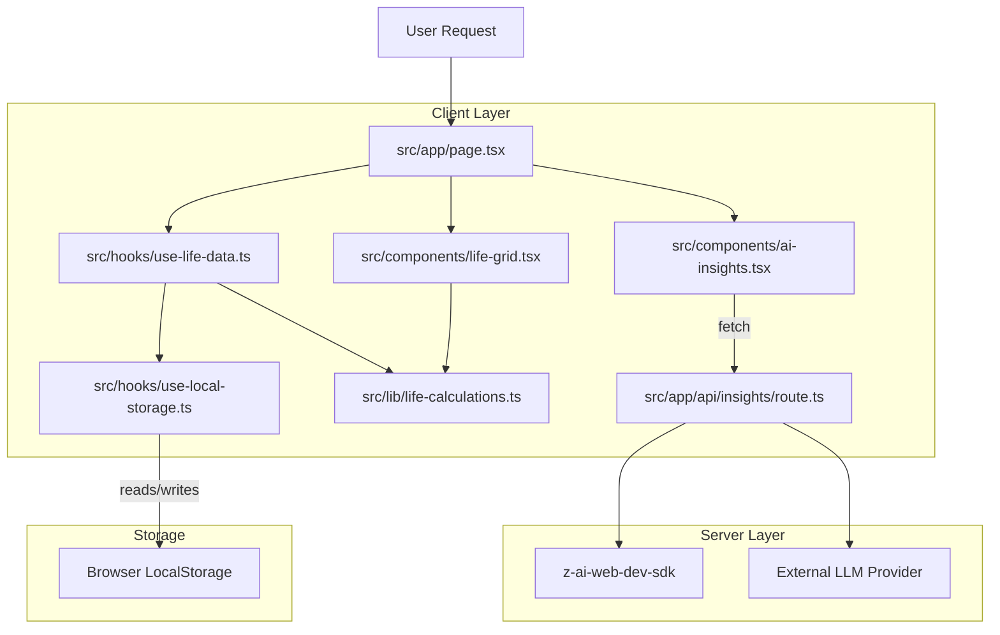

# Architectural Analysis: Life in Dots 2.0

## 1. PROJECT OVERVIEW

- **Project Name & Type:** Life in Dots 2.0 (Web Application / Personal Dashboard)
- **Tech Stack:**
  - **Framework:** Next.js 16.1.1 (App Router)
  - **Language:** TypeScript
  - **Styling:** Tailwind CSS 4, Shadcn/UI (Radix Primitives), Framer Motion
  - **State Management:** Zustand, React Context (via utility hooks)
  - **Data Persistence:** `localStorage` (Custom `useLocalStorage` hook)
  - **Backend/API:** Next.js API Routes (Serverless)
  - **AI Integration:** `z-ai-web-dev-sdk` (LLM Interface)
  - **Database (Inactive):** Prisma ORM with SQLite (configured but currently unused in main flow)
- **Architecture Pattern:** Client-Side Logic with Serverless API enhancements. The application follows a "Local-First" architecture where core user data resides in the browser, while the server provides stateless AI services.
- **Entry Point:**
  - **Web:** `src/app/layout.tsx` (Root Layout) → `src/app/page.tsx` (Main Application Controller).
  - **API:** `src/app/api/insights/route.ts`.

## 2. FILE INVENTORY & CLASSIFICATION

### Core Logic

📄 `src/lib/life-calculations.ts` (TypeScript)
├─ Purpose: Pure domain logic for life calendar calculations.
├─ Role: Core Business Logic
├─ Imports: `./types`
└─ Exports: `generateLifeWeeks`, `calculateLifeStats`, `getLifePhase`, `WORLD_EVENTS`

📄 `src/hooks/use-life-data.ts` (TypeScript)
├─ Purpose: Manages application state and persistence.
├─ Role: Core State / Controller
├─ Imports: `./use-local-storage`, `@/lib/types`, `@/lib/life-calculations`
└─ Exports: `useLifeData` (Hook)

📄 `src/hooks/use-local-storage.ts` (TypeScript)
├─ Purpose: Generic hook for interacting with browser localStorage.
├─ Role: Utility / Infrastructure
└─ Exports: `useLocalStorage`

### UI Components (Key Selection)

📄 `src/app/page.tsx` (TypeScript/React)
├─ Purpose: Main dashboard view and orchestration.
├─ Role: Controller / View
├─ Imports: `useLifeData`, `LifeGrid`, `LifeStatsCard`, `AIInsights`
└─ Exports: `Home` (Page Component)

📄 `src/components/life-grid.tsx` (TypeScript/React)
├─ Purpose: Visualization of life weeks as a grid of interactive dots.
├─ Role: Core UI Component
├─ Imports: `ui/card`, `ui/dialog`, `lucide-react`
└─ Exports: `LifeGrid`

📄 `src/components/ai-insights.tsx` (TypeScript/React)
├─ Purpose: Interface for fetching and displaying AI-generated life advice.
├─ Role: Feature Component
├─ Imports: `z-ai-web-dev-sdk` (implied usage via API call pattern)
└─ Exports: `AIInsights`

### Infrastructure & Configuration

📄 `src/app/api/insights/route.ts` (TypeScript)
├─ Purpose: Serverless endpoint to proxy/process AI requests.
├─ Role: Backend API
├─ Imports: `z-ai-web-dev-sdk`, `next/server`
└─ Exports: `POST` (Route Handler)

📄 `prisma/schema.prisma` (Prisma)
├─ Purpose: Database schema definition.
├─ Role: Data Layer Configuration (Currently dormant)
└─ Exports: `User`, `Post` models (Not actively linked to app logic)

📄 `src/lib/types.ts` (TypeScript)
├─ Purpose: Shared type definitions.
├─ Role: Utility
└─ Exports: `WeekEntry`, `LifePhase`, `UserSettings`, etc.

## 3. DEPENDENCY GRAPH

## 4. DATA FLOW ARCHITECTURE

**Primary Flow (User Session):**

1. **Entry:** User loads `page.tsx`.
2. **Initialization:** `useLifeData` initializes.
    - Checks `localStorage` for `life-in-dots-data`.
    - If missing, prompts `Onboarding` flow.
    - If present, hydrates `weeksData`, `settings`, and `milestones`.
3. **Calculation:** `generateLifeWeeks` (in `life-calculations.ts`) computes the structure of the grid based on `birthdate` and `lifeExpectancy`.
4. **rendering:** `page.tsx` passes computed `weeks` and `stats` to `LifeGrid` and `LifeStatsCard`.
5. **Interaction:** User clicks a week in `LifeGrid` → Modifies `selectedWeek` state → User saves journal/mood.
6. **Persistence:** `save` action calls `updateWeek` in `useLifeData` → Updates `weeksData` state → `useLocalStorage` syncs to browser.

**Secondary Flow (AI Insights):**

1. User clicks "AI Insights" tab.
2. `AIInsights` component gathers current journal entries and stats.
3. Sends `POST` request to `/api/insights` with user context.
4. API Route calls `z-ai-web-dev-sdk` to generate a prompt for an LLM ("wise life coach").
5. Response is parsed as JSON and returned to client for display.

## 5. CRITICAL COMPONENTS

- **Business Logic Core:** `src/lib/life-calculations.ts`
  - Contains the "Truth" of the application: how age, phases, and stats are derived from time.
  - Pure functions, highly testable.

- **State/Persistence:** `src/hooks/use-life-data.ts`
  - Acts as the "Controller". It mediates between the raw storage array and the domain objects (`WeekEntry`).
  - Critical for data integrity.

- **Visualization:** `src/components/life-grid.tsx`
  - The primary UX element. Handles zooming, color-coding (phases/moods), and interaction.

- **AI Integration:** `src/app/api/insights/route.ts`
  - Provides the "Smart" features. dependent on external SDK availability and keys.

- **Database Layer (Inactive):** `prisma/schema.prisma` & `src/lib/db.ts`
  - Set up for SQLite/Prisma but disconnected from the main application flow. The `User` and `Post` models are likely boilerplate or future-proofing for a cloud-sync feature.

## 6. CONFIGURATION CHAIN

- **Environment Variables:**
  - `DATABASE_URL` (in `.env` implied): Used by `prisma/schema.prisma`.
  - No explicit `env` usage seen in frontend code (relies on build-time constants or public vars if any).
  - API keys for `z-ai-web-dev-sdk` are likely managed largely by the SDK environment or `process.env`.

- **Application Constants:**
  - `LIFE_PHASES`, `MOOD_CONFIG`, `WORLD_EVENTS`: Hard-coded in `src/lib/types.ts` and `src/lib/life-calculations.ts`.
  - `STORAGE_KEY = 'life-in-dots-data'`: Defined in `use-life-data.ts`.

## 7. EXECUTION SUMMARY

- **Cold Start Path:**
    1. Browser requests `/`.
    2. Next.js serves static/SSR shell of `layout.tsx` + `page.tsx`.
    3. React hydrates. `useLifeData` hook runs.
    4. `localStorage` is read synchronously (or via effect).
    5. `generateLifeWeeks` runs (potentially expensive loop for 4000+ items).
    6. UI renders the Grid.

- **Hot Paths:**
  - `updateWeek`: User journaling.
  - `LifeGrid` rendering: Virtualization is not explicitly seen in the code snippet (uses `ScrollArea`), but `weeks` array is mapped. For ~80 years * 52 weeks = 4160 DOM elements, performance might be a concern without virtualization, though `ScrollArea` might handle some containment.

- **Circular Dependencies:** None detected. The flow is strictly hierarchical from Page -> Hooks -> Lib.

- **Dead Code:**
  - ⚠️ `src/lib/db.ts`: Imports Prisma but unused in active hooks.
  - ⚠️ `prisma/schema.prisma`: Models do not reflect the actual data structure (`StoredWeekData`).

## 8. IMPROVEMENT VECTORS

- **Performance:**
  - **Virtualization:** The `LifeGrid` renders 4000+ divs. Implementing windowing (e.g., `react-window`) would improve initial render calculation and DOM footprint.
  - **Calculation Memoization:** `generateLifeWeeks` recalculates on every render if dependencies change. Ensure `useMemo` in `use-life-data` is strictly observing only necessary changes.

- **Data Integrity:**
  - **Migration:** Moving from `localStorage` to a real DB (Supabase/Postgres via Prisma) is the logical next step to prevent data loss if browser cache is cleared.
  - **Validation:** `zod` is in `package.json` but not heavily used in the explored files. validating `localStorage` data on load would be safer.

- **Architecture:**
  - **Strict Separation:** Move `AIInsights` logic entirely to the backend API to hide prompts and handling logic, although the current route does this well.
  - **Missing Tests:** No obvious test files (`.test.ts` or `__tests__`) observed in the source tree. Core logic in `life-calculations.ts` is a prime candidate for unit testing.

- **Security:**
  - Current "User" is just a local profile. No authentication exists. Cloud sync would require implementing NextAuth (present in dependencies) properly.
